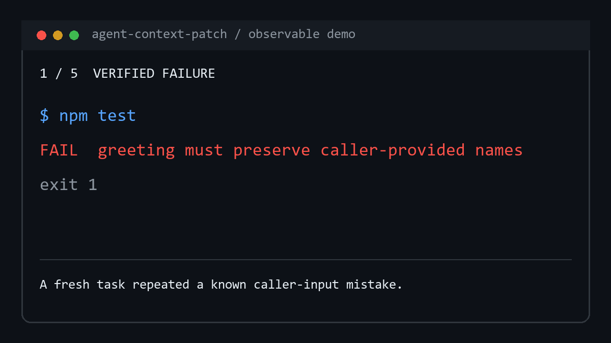

# Agent Context Patch

[简体中文](README.zh-CN.md) ·
[Latest release](https://github.com/Cherwayway/agent-context-patch/releases/latest) ·
[Install guide](AGENT_INSTALL.md) ·
[Report feedback](https://github.com/Cherwayway/agent-context-patch/issues/new?template=feedback.yml)

[](https://github.com/Cherwayway/agent-context-patch/actions/workflows/verification.yml)
[](https://github.com/Cherwayway/agent-context-patch/releases/latest)
[](LICENSE)

**Your coding Agent fixed this last week. Today, it made the same mistake
again.**

Agent Context Patch turns verified corrections into small, durable workspace
memory for **Claude Code and OpenAI Codex**. Later Agent tasks load the useful
lesson instead of rediscovering it from an old chat.

It is local and inspectable: no hosted service, no daemon, no telemetry, and no
silent global instruction edits.

Already using Claude Code Auto Memory? It is useful personal recall; Agent
Context Patch adds verified-failure gating, cross-Agent sharing, and an audited
workspace write lifecycle. [See the exact boundary](docs/why-agent-context-patch.md).

## See The Difference

| Without Agent Context Patch | With Agent Context Patch |
| --- | --- |
| A fix lives only in chat history. | The Agent identifies the reusable part after the fix passes verification. |
| A later task starts cold and repeats the mistake. | The lesson becomes a small workspace context patch that later tasks read. |
| Instructions accumulate until they are noisy or contradictory. | New lessons use replace-before-add; stale or risky changes go through review. |

For example, the executable fresh-Agent acceptance starts with a failing
greeting test that discards caller-provided names. The Agent fixes and verifies
the behavior, then adds one reusable guard to workspace context. The exact
user-facing result stays content-safe:

```text
Evolution outcome: detect=candidate; propose=created; apply=applied; proposal=2026-07-19-caller-input-data-flow; targets=.agent-context/checklists/coding.md.
```

The durable context contains the guard; the receipt never exposes lesson or
PatchPlan content.

The useful path stays short:

```text
verified failure -> reusable lesson -> safe context patch -> later Agent tasks
```

[](docs/launch/terminal-demo.md)

Ordinary one-off work stays out of the loop.

## Quick Install

### Claude Code plugin

Add the project marketplace and install the lightweight safe-install adapter:

```text
/plugin marketplace add Cherwayway/agent-context-patch
/plugin install agent-context-patch@agent-context-patch
/agent-context-patch:install
```

The plugin discovers the product inside Claude Code, but it does not silently
install the runtime or edit a workspace. The install skill resolves the latest
GitHub-enforced immutable Release, verifies its published checksum, and shows
the Bootstrap plan plus instruction patch for approval.

### Codex and other Agents

Copy this prompt into Codex or Claude Code:

```text
Install the latest stable Agent Context Patch from
https://github.com/Cherwayway/agent-context-patch/releases/latest and follow
AGENT_INSTALL.md. Resolve an immutable release, verify its checksum, run the
Bootstrap dry-run, and show me the plan plus the AGENTS.md or CLAUDE.md patch
before applying. After the approved install, run $evolve init.
```

Stable installs use GitHub-enforced immutable Releases. The moving `main`
branch is a development source, not a normal install source. Bootstrap never
merges an existing `AGENTS.md` or `CLAUDE.md` by itself.

## When It Helps

Use Agent Context Patch when:

- a long-lived workspace keeps accumulating repeated Agent corrections;
- multiple Agent tasks or tools need the same repository-specific lessons;
- an important workflow is easy to forget after context compaction;
- existing instructions have become stale, duplicated, or contradictory.

Skip it for an unverified guess, a one-off change, or anything that would store
secrets, raw conversations, customer data, or production credentials.

## What Makes It Safe

- The Agent owns semantic judgment: what happened, whether it is reusable, and
  what the smallest useful lesson is.
- Active Context stays small through replace-before-add and explicit cleanup.
- A deterministic Commit Kernel handles file safety, exact plans, conflicts,
  audit evidence, and rollback boundaries.
- Eligible low-risk workspace additions can finish in the same Agent turn.
  Approval-only operations stay behind review; see
  [Write Policies](#write-policies).

[See the executable demo](demos/README.md), the
[fresh-Agent acceptance evidence](docs/acceptance/2026-07-19-observable-delivery-checkpoint.md),
or the [architecture](CONTEXT.md).

## How It Works

1. Detect a reusable failure, correction, stale rule, or workflow lesson.
2. Fix and verify the current task first.
3. Reconcile unfinished proposal lifecycles, then search Active Context and
   replace before adding.
4. Write an evidence-backed internal audit record with an exact PatchPlan.
5. Apply an eligible low-risk plan immediately through `auto`, then finalize a
   content-safe `detect / propose / apply` receipt with no action required.
6. Ask only when a safety gate requires an exceptional decision, and keep
   Active Context current by proposing semantic cleanup.

Lifecycle reconciliation resumes only an unchanged exact plan. A matching
post-apply hash without an applied audit is reported for recovery, never treated
as proof that this proposal wrote the file. There is no background scanner or
new public command.

After a verified repair, the delivery checkpoint runs only for a high-signal
event: a failed verification that later passed, an explicit user correction,
an independent QA defect, stale workspace context, or a first fix that failed
before a later fix passed. An ordinary no-trigger task stays silent and creates
no proposal or durable context write merely to report a no-op.

## Local Bootstrap Development

PowerShell:

```powershell
powershell -ExecutionPolicy Bypass -File install/install.ps1 `
  -Mode DryRun -WorkspacePath .

# After reviewing the reported plan hash:
powershell -ExecutionPolicy Bypass -File install/install.ps1 `
  -Mode Apply -WorkspacePath . -ApprovedPlanHash <approved-hash>
```

Bash:

```bash
bash install/install.sh --mode dry-run --workspace .

# After reviewing the reported plan hash:
bash install/install.sh --mode apply --workspace . \
  --approved-plan-hash <approved-hash>
```

Pass an Agent-resolved skill target with `-SkillTargetPath` or
`--skill-target`. Pass the existing instruction file path to include a
`GuidancePatchRequired` action in the reviewed plan; Bootstrap still will not
edit that file.

## Local Upgrade Verification

After independently verifying and unpacking an immutable candidate Release,
run its Bootstrap against the installed user-level skill:

PowerShell:

```powershell
powershell -ExecutionPolicy Bypass `
  -File <candidate-release>\install\install.ps1 `
  -Mode UpdateDryRun `
  -SkillTargetPath <installed-user-skill-target>

# After reviewing and approving the exact plan hash:
powershell -ExecutionPolicy Bypass `
  -File <candidate-release>\install\install.ps1 `
  -Mode UpdateApply `
  -SkillTargetPath <installed-user-skill-target> `
  -ApprovedPlanHash <approved-hash>
```

Bash:

```bash
bash <candidate-release>/install/install.sh \
  --mode update-dry-run \
  --skill-target <installed-user-skill-target>

# After reviewing and approving the exact plan hash:
bash <candidate-release>/install/install.sh \
  --mode update-apply \
  --skill-target <installed-user-skill-target> \
  --approved-plan-hash <approved-hash>
```

The candidate script determines the update source. Update modes do not inspect
or write workspace context, edit instruction files, or authorize schema
migration. They bind the exact installed and candidate managed trees to the
approved plan, back up the prior skill, verify the replacement, and restore the
prior version on failure.

The v0.2.0 skill predates `$evolve update`. Its first upgrade uses this candidate
Bootstrap sequence as a one-time compatibility handoff; later checks use the
single public `$evolve update` command.

## Workspace Context

V1 writes Active Context only inside the workspace:

```text
.agent-context/
  PROJECT_CONTEXT_INDEX.md
  PROJECT_PROFILE.md
  config.yml
  checklists/
  proposals/
  reports/
  archive/
```

Ordinary tasks read only the index, profile, and relevant enabled checklists.
Proposals own their Decision Log and Apply Attempts. Reports are derived and
archives are inactive. There is no separate mistake or receipt store.

## Commands

`$evolve init`

Inspect the workspace, report `contextRead`, and apply eligible profile or index
additions automatically. Detect domain candidates with evidence and request one
decision only if config or domain activation must change; only
`config.enabled_domains` records activation.

`$evolve after-failure`

The Agent invokes this autonomously after a reusable failure or correction. It
fixes and verifies the current task, performs replace-before-add analysis,
reconciles unfinished proposals, creates one evidence-backed audit record, and
immediately applies an eligible low-risk addition. Success returns one compact
receipt covering `detect`, `propose`, and `apply`; overlap or conflict produces
an approval-only cleanup proposal instead of automatic accumulation.

`$evolve approve`

Handle only the exception path that requires a human decision. Show a concise
semantic summary followed by the complete exact PatchPlan. The user may simply
reply with approval and never needs to copy the plan hash. A changed file still
invalidates authorization; an unchanged already-approved plan may resume on a
later Agent turn, while a failed commit never becomes `applied`.

`$evolve review-context`

Reconcile unfinished proposals, then review conflicts, staleness, duplication,
authority, and retention value.
Quantity is only a review trigger. Semantic merge, rewrite, supersede, and
archive changes always require approval.

`$evolve weekly`

Reconcile unfinished proposals, then create a derived report of recurring
lessons, proposal health, cleanup candidates, applied improvements, and watch
items. Reports never overwrite Active Context.

`$evolve update`

Explicitly check the latest stable immutable Release, verify its checksum, tag,
and source commit, then show the complete UpdatePlan and exact plan hash before
any user-level skill replacement. A successful update takes effect in a new
Agent task. There is no background check, telemetry, or silent upgrade.
For prompt external notice, subscribe to this repository's GitHub Release
notifications; run `$evolve update` when you choose to check or upgrade.

## Write Policies

```yaml
context_write_policy: auto
```

Supported policies:

- `auto`: the default write policy for new workspaces; apply eligible low-risk
  create/update plans through the Node Commit Kernel in the current Agent turn.
  The kernel rechecks workspace config; checklist writes are eligible only for
  enabled domains.
- `propose`: an explicit cautious mode, also preserved for existing workspaces;
  draft a plan and wait for exact approval.

If Node or the kernel is unavailable, `auto` explicitly degrades to `propose`.
Delete, archive, supersede, migration, instruction-file, domain-activation, and
user-global promotion operations always require human approval.

Bootstrap and Kit updates never rewrite an existing workspace policy. After a
successful high-signal repair the Agent prints only the shared content-safe
Outcome receipt: all three stages, stable non-success reasons, and the proposal
ID plus workspace-relative targets when available. It does not expose lesson or
plan content or ask the user to approve or reply on an applied path.

## Context Health

Context is not improved merely by getting larger.

- New rules run replace-before-add analysis.
- Authority decides which evidence wins a conflict.
- Retention value decides whether a rule still earns Active Context space.
- Budget thresholds trigger review and may block `auto`; they never truncate
  context.
- Cleanup is proposed with the behavior lost, replacement rule, and net context
  change visible.

## Evidence Privacy

Evidence is pointer-first and summary-first:

- use workspace-relative file references, commands, exit codes, and hashes;
- paraphrase user corrections;
- do not persist raw conversations, complete logs, secrets, credentials,
  customer data, or unnecessary personal details;
- scrub workspace-specific information before user-global promotion.

## Legacy Workspaces

An unversioned `.agent-context/` tree is `legacy_v0` and read-only. V1 may read
it through a legacy adapter, but migration requires a reviewed MigrationPlan,
backup, exact approval, and ApplyAttempt. Bootstrap never overwrites legacy
context with new templates.

## Architecture

See [CONTEXT.md](CONTEXT.md) for the domain language,
[ADR-0001](docs/adr/0001-agent-first-context-evolution.md) for the original
architecture, and
[ADR-0003](docs/adr/0003-auto-first-low-risk-context.md) for the auto-first
default. [ADR-0005](docs/adr/0005-observable-evolution-outcomes.md) defines the
delivery checkpoint and three-stage ephemeral outcome. The
[v1 verification matrix](docs/v1-verification-matrix.md) maps every accepted
decision to its durable contract and test evidence.

## Development

Run the single verification interface:

```bash
npm test
```

The gate executes real demo behavior, protocol fixtures, Commit Kernel and
Lifecycle/Outcome behavior, Bootstrap dry-run/apply/idempotency, repository
hygiene, and platform contracts. CI runs the same interface on Windows and
Ubuntu.
