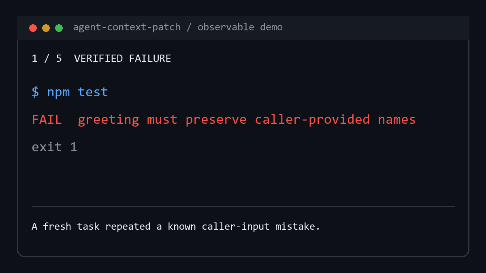

# Agent Context Patch

[简体中文](README.zh-CN.md) ·
[Latest release](https://github.com/Cherwayway/agent-context-patch/releases/latest) ·
[Install guide](AGENT_INSTALL.md) ·
[Report feedback](https://github.com/Cherwayway/agent-context-patch/issues/new?template=feedback.yml)

[](https://github.com/Cherwayway/agent-context-patch/actions/workflows/verification.yml)
[](https://github.com/Cherwayway/agent-context-patch/releases/latest)
[](LICENSE)

**Your coding Agent fixed this last week. Today, it made the same mistake
again.**

Agent Context Patch turns verified corrections into small, durable workspace
memory for **Claude Code and OpenAI Codex**. Every later Agent task sees a
one-line catalog of those lessons inside the instruction file it already reads,
and fetches the full rule only when the hook matches the task, instead of
rediscovering a lesson from an old chat or loading every accumulated rule.

It is local and inspectable: no hosted service, no daemon, no telemetry, and no
silent global instruction edits.

Already using Claude Code Auto Memory? It is useful personal recall; Agent
Context Patch adds verified-failure gating, cross-Agent sharing, and an audited
workspace write lifecycle. [See the exact boundary](docs/why-agent-context-patch.md).

## See The Difference

| Without Agent Context Patch | With Agent Context Patch |
| --- | --- |
| A fix lives only in chat history. | The Agent identifies the reusable part after the fix passes verification. |
| A later task starts cold and repeats the mistake. | The lesson becomes a small workspace context patch that later tasks can select from hard task signals. |
| Instructions accumulate until they are noisy or contradictory. | New lessons use replace-before-add; stale or risky changes go through review. |

For example, the executable fresh-Agent acceptance starts with a failing
greeting test that discards caller-provided names. The Agent fixes and verifies
the behavior, then adds one reusable guard to workspace context. The exact
user-facing result stays content-safe:

```text
Evolution outcome: detect=candidate; propose=created; apply=applied; proposal=2026-07-19-caller-input-data-flow; targets=.agent-context/rules/caller-input-data-flow.md; catalog=612B/1 rules.
```

The durable context contains the guard; the receipt never exposes lesson or
proposal content.

The useful path stays short:

```text
verified failure -> reusable lesson -> safe context patch -> later Agent tasks
```

[](docs/launch/terminal-demo.md)

Ordinary one-off work stays out of the loop.

## Quick Install

### Claude Code plugin

Add the project marketplace and install the lightweight safe-install adapter:

```text
/plugin marketplace add Cherwayway/agent-context-patch
/plugin install agent-context-patch@agent-context-patch
/agent-context-patch:install
```

The plugin discovers the product inside Claude Code, but it does not silently
install the runtime or edit a workspace. The install skill resolves the latest
GitHub-enforced immutable Release, verifies its published checksum, and shows
the Bootstrap plan plus instruction patch for approval.

### Codex and other Agents

Copy this prompt into Codex or Claude Code:

```text
Install the latest stable Agent Context Patch from
https://github.com/Cherwayway/agent-context-patch/releases/latest and follow
AGENT_INSTALL.md. Resolve an immutable release, verify its checksum, run the
Bootstrap dry-run, and show me the plan plus the AGENTS.md or CLAUDE.md patch
before applying. After the approved install, run $evolve init.
```

Stable installs use GitHub-enforced immutable Releases. The moving `main`
branch is a development source, not a normal install source. Bootstrap never
merges an existing `AGENTS.md` or `CLAUDE.md` by itself.

## When It Helps

Use Agent Context Patch when:

- a long-lived workspace keeps accumulating repeated Agent corrections;
- multiple Agent tasks or tools need the same repository-specific lessons;
- an important workflow is easy to forget after context compaction;
- existing instructions have become stale, duplicated, or contradictory.

Skip it for an unverified guess, a one-off change, or anything that would store
secrets, raw conversations, customer data, or production credentials.

## What Makes It Safe

- The Agent owns semantic judgment: what happened, whether it is reusable, and
  what the smallest useful lesson is.
- The catalog has a hard byte budget, and a new hook that overlaps an active
  one is blocked mechanically, so context stays small by construction.
- Every write goes through one gated `apply`: schema, verified fix, privacy
  scan, byte limits, similarity, budget, then an atomic commit with an audit
  record and a unified diff.
- The runtime touches only `.agent-context/` and the managed block of the
  instruction file; everything else in `AGENTS.md` or `CLAUDE.md` is never
  edited.
- Eligible low-risk additions finish in the same Agent turn. Overlap and
  budget exceptions need a human decision; see
  [Write Policies](#write-policies).

[See the executable demo](demos/README.md), the
[fresh-Agent acceptance evidence](docs/acceptance/2026-07-19-observable-delivery-checkpoint.md),
or the [architecture](CONTEXT.md).

## How It Works

1. The workspace instruction file carries a generated `acp-catalog` block: one
   hook line per active rule, grouped by repo and operation, followed by dated
   working state. Codex reads `AGENTS.md` literally and Claude Code imports it,
   so both agents see the same catalog with no read decision.
2. When a hook matches the task, the Agent reads that rule's body, either
   directly or through `evolve select` with a task signature built from paths,
   operations, skills, and repos. Skills call `select` with a fixed signature
   when they activate, so gate rules ride along with the workflow.
3. The Agent fixes and verifies the current task first.
4. After a verified repair, the delivery checkpoint runs only for a high-signal
   event: a failed verification that later passed, an explicit user correction,
   an independent QA defect, stale workspace context, or a first fix that failed
   before a later fix passed. An ordinary no-trigger task stays silent.
5. The Agent authors one proposal (trigger, evidence, operations) and calls
   `evolve apply`. The runtime validates, runs every gate, writes the rule and
   state files atomically, records an audit with a unified diff, and re-renders
   the catalog, then returns one content-safe `detect / propose / apply`
   receipt.
6. At the end of the task the Agent records which rules were actually used with
   `evolve consult`. The weekly review ranks, merges, and retires by those
   counters.

## Read-First Catalog

The catalog is the whole point of this release. A lesson that is stored but
never read is worthless, so Schema 2 makes the read side free:

```markdown
<!-- acp-catalog: kit=0.8.0 schema=2 rendered=2026-09-14T08:12:31.000Z rules=12 state=1 -->
## Workspace Context Catalog

### ilands · migration
- gate [hot-table-partial-index-cic] Adding a partial index on a hot table: run CIC in its own workflow step and reject the batch when it fails.

### any · general
- gate [verify-before-evolve] Before evolving context: the current fix must be verified.

### STATE (auto-expires)
- (09-21) ilands: PR 3070 is in review round 3; index recycling is a separate PR.
<!-- /acp-catalog -->
```

- Each rule is one file, `.agent-context/rules/<id>.md`, with a hook of at
  most 160 bytes ("situation + action"), a kind (`gate`, `advice`, `fact`), an
  `applies_to` scope (repos, path globs, ops, skills), and a body of at most
  1500 bytes.
- The block is at most 8 KB. When an addition would exceed it, `apply` is
  blocked until something is superseded or retired.
- `evolve select --signature '{"paths":[...],"ops":[...],"skills":[...]}'`
  returns matching rule bodies: repos filter, any intersecting dimension
  matches, global gates always ride along, gates first, capped at 12 KB.
- `evolve consult --consulted a,b --missed c` writes real use counters back
  into rule frontmatter. This is the first "was the rule used" data the project
  has had, and the weekly report is built from it.
- Everything outside the managed block is never touched.

## Local Bootstrap Development

PowerShell:

```powershell
powershell -ExecutionPolicy Bypass -File install/install.ps1 `
  -Mode DryRun -WorkspacePath .

# After reviewing the reported plan hash:
powershell -ExecutionPolicy Bypass -File install/install.ps1 `
  -Mode Apply -WorkspacePath . -ApprovedPlanHash <approved-hash>
```

Bash:

```bash
bash install/install.sh --mode dry-run --workspace .

# After reviewing the reported plan hash:
bash install/install.sh --mode apply --workspace . \
  --approved-plan-hash <approved-hash>
```

Pass an Agent-resolved skill target with `-SkillTargetPath` or
`--skill-target`. Pass the existing instruction file path to include a
`GuidancePatchRequired` action in the reviewed plan; Bootstrap still will not
edit that file.

## Local Upgrade Verification

After independently verifying and unpacking an immutable candidate Release,
run its Bootstrap against the installed user-level skill:

PowerShell:

```powershell
powershell -ExecutionPolicy Bypass `
  -File <candidate-release>\install\install.ps1 `
  -Mode UpdateDryRun `
  -SkillTargetPath <installed-user-skill-target>

# After reviewing and approving the exact plan hash:
powershell -ExecutionPolicy Bypass `
  -File <candidate-release>\install\install.ps1 `
  -Mode UpdateApply `
  -SkillTargetPath <installed-user-skill-target> `
  -ApprovedPlanHash <approved-hash>
```

Bash:

```bash
bash <candidate-release>/install/install.sh \
  --mode update-dry-run \
  --skill-target <installed-user-skill-target>

# After reviewing and approving the exact plan hash:
bash <candidate-release>/install/install.sh \
  --mode update-apply \
  --skill-target <installed-user-skill-target> \
  --approved-plan-hash <approved-hash>
```

The candidate script determines the update source. Update modes do not inspect
or write workspace context, edit instruction files, or authorize schema
migration. They bind the exact installed and candidate managed trees to the
approved plan, back up the prior skill, verify the replacement, and restore the
prior version on failure.

The v0.2.0 skill predates `$evolve update`. Its first upgrade uses this candidate
Bootstrap sequence as a one-time compatibility handoff; later checks use the
single public `$evolve update` command.

## Workspace Context

Schema 2 keeps everything under `.agent-context/`:

```text
.agent-context/
  config.yml            schema_version 2, write_policy, agents_file, budgets, state TTLs
  rules/<id>.md         one rule per file: frontmatter (hook, kind, applies_to, counters) + body
  STATE.yml             dated working state; every entry expires (default 14 days, max 90)
  PROFILE.md            verified workspace facts only, never rules
  proposals/<id>.md     one audit record per applied change: evidence + unified diff
  reports/              rebuildable weekly reviews
  archive/              superseded or retired rules, expired state, pre-migration history
```

The catalog rendered into the instruction file is derived from `rules/` and
`STATE.yml`; it is never a second source of truth. Proposals are audit records,
not an inbox: an applied change and its record are written in the same call.
Reports are derived and the archive is inactive.

## Commands

Run every command as `node <installed-skill>/runtime/cli.mjs <command>`,
where the installed skill is the user-level evolve directory. Every command
accepts `--workspace <dir>` and `--today YYYY-MM-DD`.

- `init`: create a Schema 2 workspace and render the empty catalog block.
- `status`: validate the workspace and print a JSON summary (rules, drafts
  needing rewrite, state entries, catalog bytes against budget, policy).
- `catalog [--write]`: print the block, or re-render it into the instruction
  file.
- `select --signature '<json>' | @file [--json] [--cursor <token>] [--bytes <n>]`: read task bodies with actual repo scope. Incomplete pages exit 1; read every page. JSON is a routing manifest.
- `apply --proposal '<json>' | @file [--approved]`: validate, gate, write,
  audit, and re-render in one call. Statuses: `applied`,
  `approval_required`, `blocked`, `failed`.
- `consult --consulted a,b [--missed c,d]`: record real use in rule
  frontmatter.
- `expire`: archive expired STATE entries and re-render the catalog.
- `weekly [--memory-dir <dir>]`: write `reports/weekly-<date>.md`.
- `memory-sync --memory-dir <dir> [--dry-run]`: regenerate Claude Code's
  per-project `MEMORY.md` as a view that keeps only `user` memories and
  reports the rest as migration candidates.
- `migrate-v1`: convert a Schema 1 workspace in place, once, lossily.
- `receipt --detect <status>:<reason> --propose <status>:<reason>`: format a
  no-candidate receipt.
- `$evolve update`: explicitly check the latest stable immutable Release,
  verify its checksum, tag, and source commit, then show the complete
  UpdatePlan and exact plan hash before any user-level skill replacement. A
  successful update takes effect in a new Agent task. There is no background
  check, telemetry, or silent upgrade. For prompt external notice, subscribe
  to this repository's GitHub Release notifications; run `$evolve update` when
  you choose to check or upgrade.

## Write Policies

```yaml
write_policy: auto
```

- `auto`: the default for new workspaces. A proposal that passes every gate is
  applied in the same call, with no user turn.
- `propose`: an explicit cautious mode, also preserved from existing Schema 1
  config by `migrate-v1`. `apply` returns `approval_required` until the same
  call is repeated with `--approved`.

`--approved` records a human decision and bypasses only the similarity gate and
the catalog budget. It never bypasses schema validation, the verified-fix
requirement, the privacy scan, byte limits, or the profile hash check.

Bootstrap and Kit updates never rewrite an existing workspace policy. After a
successful high-signal repair the Agent prints only the receipt line returned
by `apply`: three stages, the proposal id, workspace-relative targets, and the
catalog size. It does not expose lesson content or ask the user to reply on an
applied path.

## Context Health

Context is not improved merely by getting larger.

- A new hook whose token similarity with an active hook is at or above 0.5 is
  blocked with `similar_rule_exists`; the fix is a `supersede` operation, not
  a reworded add.
- The 8 KB catalog budget blocks additions until something is superseded or
  retired.
- `consulted`, `last_consulted`, and `missed` counters record real use; the
  weekly report lists most-consulted rules, relevant-but-missed rules, rules
  never consulted in 30 days, similar hook pairs at or above 0.35, and state
  expiring within three days.
- STATE entries expire automatically; nothing dated lives in a rule.
- The report recommends; only `apply` changes context.

## Evidence Privacy

Evidence is pointer-first and summary-first:

- use workspace-relative file references, commands, exit codes, and hashes;
- paraphrase user corrections;
- do not persist raw conversations, complete logs, secrets, credentials,
  customer data, or unnecessary personal details;
- scrub workspace-specific information before user-global promotion.

The privacy scan runs on every proposal and fails on private keys, well-known
token shapes, credential assignments, and absolute user-home paths.
`--approved` cannot bypass it.

## Legacy Workspaces

A Schema 1 workspace (`PROJECT_CONTEXT_INDEX.md`, `PROJECT_PROFILE.md`,
`checklists/`, PatchPlan proposals) is not read by Kit 0.8.0. `migrate-v1`
converts it in place, once: every checklist bullet and profile rule becomes a
draft rule flagged `needs_rewrite`, history moves to `archive/`, and the
catalog is rendered. The conversion is lossy and accepted as such; the
original files stay in `archive/` for reference. Right after migration the
catalog usually exceeds its budget, so the next step is a one-time rewrite and
merge pass (target: at most 60 rules) before new additions are accepted.
Bootstrap never converts a workspace on its own.

## Architecture

See [CONTEXT.md](CONTEXT.md) for the domain language,
[ADR-0001](docs/adr/0001-agent-first-context-evolution.md) for the original
architecture,
[ADR-0003](docs/adr/0003-auto-first-low-risk-context.md) for the auto-first
default, [ADR-0005](docs/adr/0005-observable-evolution-outcomes.md) for the
delivery checkpoint and the receipt line, and
[ADR-0010](docs/adr/0010-read-first-catalog-and-schema-2.md) for the
read-first catalog, Workspace Schema 2, and the removal of the compiler,
lifecycle coordinator, and marker-based rules. The
[verification matrix](docs/v1-verification-matrix.md) maps each behavior to
its test file.

## Development

Run the single verification interface:

```bash
npm test
```

The gate runs the runtime tests under `tests/runtime/` (YAML subset, text
helpers, workspace validation, catalog render and replace, selection, apply
gates and rollback, consult writeback, weekly, memory bridge, migrate-v1, and
the CLI), the Bootstrap installer tests (dry-run, apply, idempotency,
upgrade), and repository hygiene. CI runs the same interface on Windows and
Ubuntu.

## Reading and maintaining context in 0.8

Supply actual repos, relevant paths and the current operation to `select`.
Missing repo scope is explicit; global gates come first. `complete: false`
and exit 1 mean bodies remain unread. Continue with the same signature and
`--cursor`; changed sources require restarting. JSON lists routes without bodies.
Status/weekly compare semantic catalog freshness, archive lineage and recent
growth. A missed rule calls for investigation, not an automatic rewrite.
Normal writers lock before reading and roll back handled failures including
audits/catalogs. Abrupt termination needs inspection; it is not crash-atomic.
