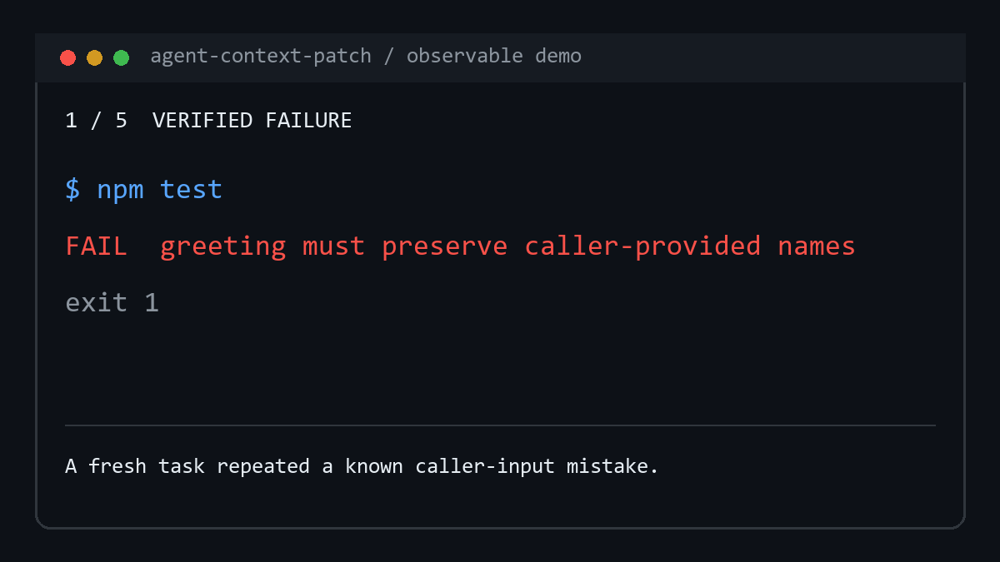

# 60–90 Seconds Terminal Demo

The 74-second observable walkthrough below is generated from an executed
fail-to-pass transition in `demos/fake-js-repo` plus the repository's validated
applied proposal evidence. It contains selected outcomes only: no temporary
absolute path, raw conversation, complete log, secret, or full PatchPlan.

[](../assets/agent-context-patch-terminal-demo-full.gif)

The tightly cropped link-preview cut is
[`docs/assets/agent-context-patch-terminal-demo.gif`](../assets/agent-context-patch-terminal-demo.gif).
Regenerate both assets with `python scripts/render-terminal-demo.py` after
installing Pillow. The generator fails unless the broken fixture fails for the
expected reason, the repaired fixture passes, and the applied proposal retains
its verified evidence.

The shot list below remains the blueprint for a narrated video recording. Use a
disposable copy of the demo; never record a customer repository or private
workspace.

## Setup before recording

1. Copy `demos/fake-js-repo` to a temporary directory.
2. Remove the already-applied greeting guard from the copied
   `.agent-context/PROJECT_PROFILE.md` and checklist.
3. Remove the copied proposal aggregate so the recording begins fresh.
4. Change the copied `src/greeting.js` to ignore the caller-provided name.
5. Keep the terminal width near 100 columns and increase the font enough for a
   phone-sized preview.

The setup stays off camera. Verify that the first test fails for the intended
caller-input reason before recording.

## Shot list

| Time | Screen action | Narration or caption |
| --- | --- | --- |
| 0–8s | Run the greeting test; show the expected name and wrong generic output. | “Your coding Agent fixed this before. A fresh task forgot.” |
| 8–25s | Ask the Agent to repair the behavior. Show the small source diff. | “First, fix the current task. Memory never replaces verification.” |
| 25–38s | Re-run the test and show PASS. | “Only a verified correction can become a durable lesson.” |
| 38–58s | Let the Agent detect the reusable caller-input failure family and prepare the bounded workspace patch. | “The Agent owns meaning; the kernel owns paths, hashes, conflicts, and rollback.” |
| 58–72s | Show the one-line Evolution Outcome receipt. | “Low-risk additions finish now; risky changes stay behind review.” |
| 72–88s | Start a fresh Agent task and show it reading the active guard before touching the greeting. | “The next task starts with the useful lesson, not the old chat.” |

Use this exact content-safe receipt shape on screen:

```text
Evolution outcome: detect=candidate; propose=created; apply=applied; proposal=2026-07-19-caller-input-data-flow; targets=.agent-context/checklists/coding.md.
```

The recording must expose no raw conversation, lesson prose, full PatchPlan,
private absolute path, or customer data.

## End card

```text
Verified failure -> safe context patch -> better next Agent task

Claude Code + OpenAI Codex
github.com/Cherwayway/agent-context-patch
```

Export one 16:9 version with captions and one tightly cropped GIF or MP4 under
15 seconds that shows only fail -> pass -> receipt. Use the short cut in link
previews and the full recording in launch posts.
